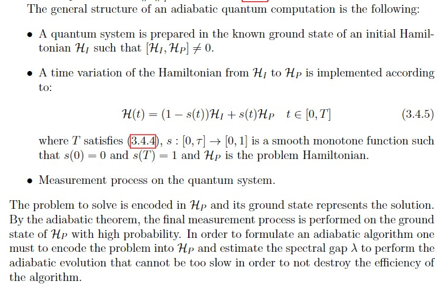

# Day-02 C02 : Quantum Machine Learning - Quantum Encoding, Universal Quantum Computational Model

## 0. Review

Previously we studyied about quantum encoding and it's properties like quantum no cloning theorem, quantum data etc.

**No-Cloning Theorem** : A quantum cloner does't exist.

It is the fundamental aspects of secure quantum communication. Thus, the possibility of copying intercepted quantum states an eavesdropper must extract information only performing measurements corrupting the transmission and revealing  his/her  presence.   Quantum  no-cloning  is  a  resource  for  data  security, however it is also a limitation because it prevents the existence of repeaters for long-range quantum communications. it also prevents backup copies of a quantum state for error correction during a computation.

## 1. Introduction

In Quantum Machine Learning, when we consider the implementation of a perceptron, the no-cloning limits the direct construction of a feed-forward neural network because the quantumoutput of a neuron cannot be copied to feed other neurons.

Thus a lossless conversion of quantum information into classical information is not allowed. A general prescription of performing a measurement on an arbitrary quantum state and using the outcomes to re-prepare exactly the initialquantum state then such a prescription is not consistent with no-cloning theorem

Encoding data into quantum states enables several applications of quantum phenomena to computation. Thus, Initialization of the data superpositions allows us for efficient computation by quantum parallelism and entanglement among the quantum registers provides some different kind of data processing without a classical counter part.

Example : Quantum Implementation of Binary Classifier based on the amplitude encoding of training vectors that are put in superposition, unclassified vector is put in superposition of two possible classes. Then the entire training set and the new feature vectorare entangled with an ancillary qubit so that the execution of the classifier is doneprocessing a single qubit regardless the size of the training set and dimension of thefeature space.

## 2. Quantum Circuits

In Classical Computing, a Turing Machine is said to be Universal Model of Classical Computation. Similarly There exist a quantum analogy of turing machine called quantum turing machine which provides notation of universal quantum computer. The  proof  of  the  computational  equivalence  between quantum circuits and quantum Turing machine.

**Definition :** A  system  of n-qubits,  described  in  the  Hilbert  space $H_n \approx (C^2)^{⊗n}$,  is  calledn-qubit  registerand  any  unitary  operator  on $H_n$ is  called n-qubit gate.

**Proposition :** For  any  1-qubit gate $U$ there  exist  unitary  operators $A;B;C$ satisfying $ABC=I$ and $\alpha ∈ R$ such that

$$
U = e^{i \alpha} A \sigma_x B \sigma_x C
$$

**Quantum Measurement :** In quantum computations, measurement processes obviously play a crucial rolebecause they enable the readout of the results and realize projection operations overthe quantum registers. In quantum circuits measurement process w.r.t computational basis. The actionof a quantum gate can be controlled by the outcome of a measurement.

**Universal Quantum Computation :** A set of quantum gates is said to be universal for quantum computation if,  for  all$n∈N$,  any n-qubit  gate  can  be  approximated  to  arbitrary accuracy by a composition of only those gates.

**Theorem :** The set $\{H, S, T, CNOT\}$ is universal for quantum computation.

## 3. Quantum Oracles

An Oracle is defined as an abstract black box that computes a function $f:B^n \to B^m$ as a single operation. $f$ need not be invertible, in order to perform a reversible computation by redefining the oracle.

Many quantum algorithms are based around the analysis of some function $f(x)$. Often these algorithms simply assume the existence of some 'black box' implementation of this function, which we can give an input $x$ and receive the corresponding output $f(x)$. This is referred to as an *oracle*.

The advantage of thinking of the oracle in this abstract way allows us to concentrate on the quantum techniques we use to analyze the function, rather than the function itself.

In order to understand how an oracle works within a quantum algorithm, we need to be specific about how they are defined. One of the  main forms that oracles take is that of *Boolean oracles*. These are described by the following unitary evolution,

$$
U_f \left|x , \bar 0 \right\rangle = \left|x, f(x)\right\rangle.
$$

Here $\left|x , \bar 0 \right\rangle = \left|x \right\rangle \otimes \left|\bar 0 \right\rangle$ is used to represent a multi-qubit state consisting of two registers. The first register is in state $\left|x\right\rangle$, where $x$ is a binary representation of the input to our function. The number of qubits in this register is the number of bits required to represent the inputs.

The job of the second register is to similarly encode the output. Specifically, the state of this register after applying $U_f$ will be a binary representation of the output $\left|f(x)\right\rangle$, and this register will consist of as many qubits as are required for this. This initial state $\left|\bar 0 \right\rangle$ for this register represents the state for which all qubits are $\left|0 \right\rangle$. For other initial states, applying $U_f$ will lead to different results. The specific results that arise will depend on how we define the unitary $U_f$.

Another form of oracle is the *phase oracle*, which is defined as follows,

$$
P_f \left|x \right\rangle = (-1)^{f(x)} \left|x \right\rangle,
$$

where the output $f(x)$ is typically a simple bit value of $0$ or $1$.

Though it seems much different in form from the Boolean oracle, it is very much another expression of the same basic idea. In fact, it can be realized using the same 'phase kickback' mechanism as described in a previous section.

To see this, consider the Boolean oracle $U_f$ that would correspond to the same function. This can be implemented as something that is essentially a generalized form of the controlled-NOT. It is controlled on the input register, such that it leaves the output bit in state $\left|0 \right\rangle$ for $f(x)=0$, and applies an $X$ to flip it to $\left|1 \right\rangle$ if $f(x)=1$. If the initial state of the output register were $\left|- \right\rangle$ rather than $\left|0 \right\rangle$, the effect of $U_f$ would then be to induce exactly the phase of $(-1)^{f(x)}$ required.

$$
U_f \left( \left|x \right\rangle \otimes \left| - \right\rangle \right) = (P_f \otimes I) \left( \left|x \right\rangle \otimes \left| - \right\rangle \right)
$$

Since the $\left|- \right\rangle$ state of the output qubit is left unchanged by the whole process, it can safely be ignored. The end effect is therefore that the phase oracle is simply implemented by the corresponding Boolean oracle.

## 4. Adiabatic Quantum Computing

Adiabatic quantum computing (AQC) was proposed as an application ofquantumadiabatic  theoremto solve optimization problems. it is also a equivalent to universal quantum circuit model for quantum computation.

<html>

</html>

## 5. Quantum Annealing

Quantum Annealing is some type of heuristic search which is used to solve optimization problems. Solution of the problem corresponding to ground state of quantum system with total energy described by Hamiltonian $H_p$ on the Hilbert Space.

The annealing procedure is implemented by a time evolution of the quantum system towards the ground state of the problem Hamiltonian. In AQC the considered quantum system  is  assumed  to  be  isolated  so  its  dynamics  is  unitary,  in  QA  the  quantum hardware is considered as an open system interacting with the environment then its dynamics is characterized by decoherence and energy dissipation.

Let the time dependent Hamiltonian

$$
H(t) = \Alpha (t) H_D + H_P
$$

 where

$H_P$ is Hamiltonian Problem and $H_D$ is Transcerse field Hamiltonian/ Disordering Hamiltonian.

## 6. Conclusion

We learned about the Quantum Encoding, Universal Quantum Computational Model like Quantum Circuits, Quantum Oracle ,Adiabatic Quantum Computing, Quantum Annealing

To learned more about quantum machine learning, subscribe my profile for future articles

## Reference 
1. Qiskit Textbook Online
2. Quantum Machine Learning Online Articles.