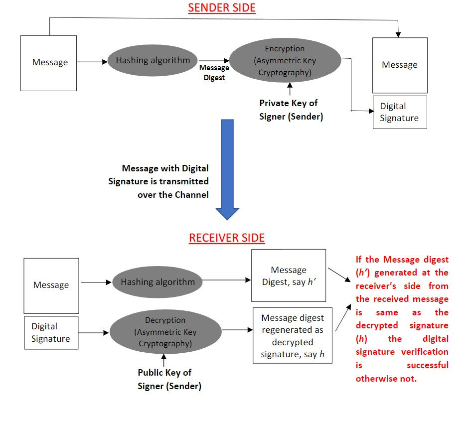

# Digital Signature

## Need for Digital Signature

There is a need for the concept of signature in computing environment. When Alice sends a message to Bob, disputes can arise between Alice and Bob in several ways:

- Alice can deny having sent the message or she can claim that the contents of the message she had sent have been altered.
- Bob can create a fraudulent message in several ways:
  - He can alter a message received from Alice and can claim that the altered message is the one that came from Alice.
  - He can forge a message, and claim that it came from Alice. - He can produce an expired or out of context message previously sent by Alice.

Message authentication code (MAC) cannot be used as digital signature because it is based on a shared secret between the sender and the receiver. It cannot resolve the disputes that arise between the sender and the receiver. MAC is suitable only for protection against attacks by the third party. So, unlike MAC, digital signature provides all of the following three services:

1. Message integrity verification
2. Data-origin authentication
3. Non-repudiation

### Characteristics of digital signature

The digital signature must have the following characteristics to serve the intended purpose:

1. A digital signature must depend on the content of the message so that the content could be verified using the signature.
2. Digital signature must bear identity of the signer based on some secret known only to the signer. This requirement ensures that

- No one else can forge a signature
- The signer cannot disown his signature later

4. Digital signature should be verifiable by all without using the signer’s secret.
5. The signature algorithm must somehow bind the signature to the message so that the signature cannot be lifted from one message/document and used with another.
6. Digital signature should bear the context (e.g. time stamp, session id etc...) to prevent a signed digital message from being misused or replayed.
7. Digital signature should be easy to compute and verify.
8. 

## Digital signature

To satisfy the required characteristics of a digital signature, digital signature schemes are based on use of asymmetric keys. Firstly, a message digest h is computed using a hashing function. This message digest is signed using private key of the signer. The signed digest h' is appended to the message as digital signature. The verification algorithm recovers the original digest h from the signed hash h’ using the public key of the sender (signer) and compares this

recovered digest with the digest computed by the receiver using the hashing function applied on the received message. If the two digests are same, the signature verification is declared successful.

## How is forgery prevented using Digital Signatures ?

Digital signature schemes are made resistant to forgery by choosing one-way and collision resistant hash function. An adversary needs to go through the following steps to forge a digital signature:

1. Choose a signed digest h’.
2. Apply verification algorithm with the sender’s public key on h’ to get unsigned digest h.
3. Find a message m that has digest h.
4. Send message m with digital signature h’ to the receiver.

Clearly, finding a message corresponding to a specific digest h is difficult (computationally infeasible) because the hash function is one-way. Also, given a signed message pair {m, h’}, the forger cannot substitute an alternative message in place of m since the hash function is collision resistant.

Further,  to  avoid  replay  attacks,  Time  Stamped  Digital  Signatures  are  used.  Here,  each message is time stamped before generating the signature. Time stamping implies appending a time field to the message. The receiver only accepts the messages that carry time stamp within a defined time window. In case there is clock synchronization issue at the sender’s and receiver’s end, an alternative is to attach a nonce and session-id to the message. A nonce is a random number used only once. When Bob expects a message from Alice, he forwards her a nonce. Alice attaches the nonce to the message while computing the digital signature for her message to Bob. Bob ensures during signature verification that Alice’s message is signed using the nonce. This avoids replay attacks by the adversary.

## Digital Certificate/Public-key Certificate

In description of digital signature scheme, it is assumed that Alice (sender) passes her public key to Bob (receiver) for verification of her signature along with the message. The adversary can easily exploit this situation. He can pose as Alice and send a fraudulent message signed using his own private key to Bob. He attaches his own public key with the signed message. Bob will find the signature in order because it will be verified successfully by Bob using the public key provided to him. So clearly, we can see in this situation fraudulent message will be wrongly treated as a genuine message.

To prevent such frauds, it is necessary to establish a trusted statutory certification authority, called  CA,  which  issues  public-key  certificates  to  individual  users.  The  CA  verifies credentials  of  the  user  and  issues  digitally  signed  public-key  certificate.  The  public-key certificate binds the public-key of the user to the user’s identity.  The public-key certificate contains the following information:

- User’s Id, his public key and applicable public-key algorithm
- Issuer’s Id, his public-key and applicable algorithm for signature verification
- Validity period of the certificate
- Digital signature of the issuer on the content of the certificate.

Every signed message must be accompanied with the sender’s public-key certificate issued by the CA. The receiver verifies the digital signature of the CA on the certificate. The public key of CA which is required for signature verification of the certificate is well known. After verifying that the digital certificate is genuine, finally, the receiver uses the sender’s public-key given in the certificate for sender’s signature verification of the original message sent by the sender.

## Steps for Digital Signature Generation and Verification

1. The sender computes a message digest (with an algorithm such as SHA1) and then encrypts the digest with his/her private key using asymmetric key encryption algorithm (like RSA) and this encrypted digest is what forms the digital signature.
2. The sender transmits the digital signature along with the message.
3. On receiving the message with the digital signature, the receiver decrypts the digital signature with the public key of the sender (or signer), thus regenerating the message digest (say h).
4. The receiver also computes a message digest (say h’) by directly applying hashing algorithm on the received message and verifies whether the two digests are the same or not. If these digests match, the message is both intact and authentic. Also, it is verified that the message was actually sent by the sender (without revealing its sender’s or signer’s secret) thereby assuring non-repudiation at the sender’s side.

The following diagram shows the Digital Signature Generation and Verification Process pictorially

